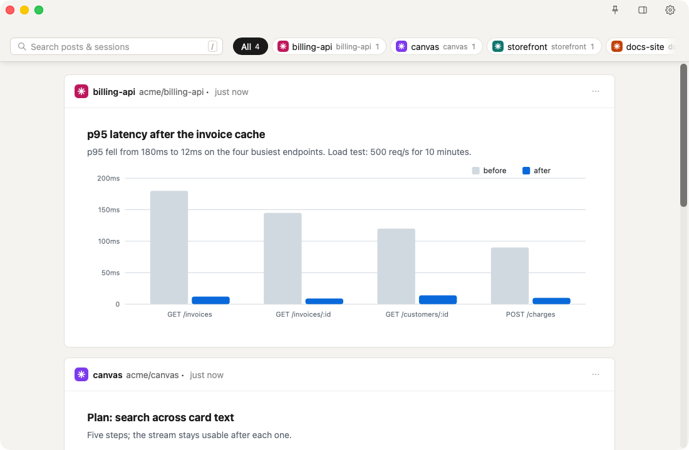

# Canvas

Canvas is a live stream of posts from every Claude Code session on your Mac.
Agents post HTML, Markdown, text and images to it on purpose: plans, charts,
diagrams, screenshots, long code. It is meant to sit open beside the terminal
all day, one card per post, with a chip per session to filter by.



It has three parts:

- **`canvas`**: one binary. `canvas daemon` holds the stream and serves it on a
  Unix socket (no network port); `canvas post` is how an agent creates a card.
- **Canvas.app**: a Tauri window and menu bar icon that shows the stream. On
  first launch it installs the `canvas` binary it carries and starts the daemon
  as a launchd agent.
- **The Claude Code plugin** in `plugin/`: session hooks that tell the agent how to post, ask it to post when a turn ends with something worth showing, plus a `canvas` skill.

## Requirements

- macOS. The daemon runs under launchd and the app is macOS-only.
- Rust 1.77.2 or newer ([rustup](https://rustup.rs)).
- The Tauri 2 CLI: `cargo install tauri-cli --version '^2'`
- [Claude Code](https://docs.anthropic.com/en/docs/claude-code), with the
  `claude` command on your `PATH`.
- `~/.local/bin` on your `PATH`. The app installs `canvas` there, and agents
  run it as plain `canvas post`.

## Build and install

The app is not code-signed, so build it yourself rather than copying a built
`Canvas.app` from someone else.

```sh
# 1. Build the canvas binary first: the app bundles target/release/canvas.
cargo build --release -p canvas

# 2. Build the app.
( cd app/src-tauri && cargo tauri build -b app )

# 3. Install it and open it once.
cp -R app/src-tauri/target/release/bundle/macos/Canvas.app /Applications/
open /Applications/Canvas.app

# 4. Install the Claude Code plugin from this checkout.
~/.local/bin/canvas install .
```

Step 3 copies the `canvas` binary to `~/.local/bin/canvas` and registers the
`com.piercemakes.canvasd` launch agent, which logs to
`~/Library/Logs/canvasd.log`. The Daemon tab in Canvas's Settings shows whether
it is installed and running.

Step 4 registers this checkout as a local plugin marketplace and installs
`canvas@canvas` from it. Restart any open Claude Code sessions to load it.

## Using it

A new Claude Code session gets posting guidance from the plugin's SessionStart
hook, and agents post on their own when a turn has something worth showing. To
post by hand from inside a session's shell:

```sh
canvas post plan.md                  # Markdown, text or HTML, by extension
echo '<h2>Hello</h2>' | canvas post - --format html
canvas post --update <card_id> plan.md   # replace a card in place
```

`canvas post` reads the session from `CLAUDE_CODE_SESSION_ID`, which Claude Code
sets in every Bash tool shell. `canvas guidance` prints the guidance text, and
`canvas profile` changes it globally or per repo (also editable in Settings).

HTML cards run in a sandboxed iframe with no network access; scripts may load
only from cdnjs, jsdelivr and unpkg.

## Development

```sh
cargo test --workspace
cargo check --manifest-path app/src-tauri/Cargo.toml

# Run the daemon and app from source on a throwaway socket.
bash scripts/verify-app.sh start
bash scripts/verify-app.sh stop

# Regenerate the README screenshot.
bash scripts/readme-shots.sh
```

`canvas daemon` refuses to start while another daemon answers on the same
socket, so running one from source against the default socket means stopping
the launch agent first:
`launchctl bootout gui/$(id -u)/com.piercemakes.canvasd`

The stream lives in `~/Library/Application Support/canvas` (`CANVAS_DATA_DIR`
to override): the newest 500 posts, and only the last 24 hours reload on
restart.

## Uninstall

```sh
claude plugin uninstall canvas@canvas
claude plugin marketplace remove canvas
rm -rf /Applications/Canvas.app
launchctl bootout gui/$(id -u)/com.piercemakes.canvasd
rm ~/Library/LaunchAgents/com.piercemakes.canvasd.plist ~/.local/bin/canvas
rm -rf ~/Library/Application\ Support/canvas
```

## License

[MIT](LICENSE)
